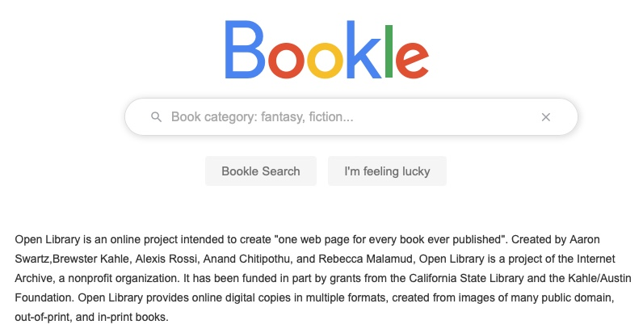

<h1 align="center">Bookle</h1>

 
Javascript Advanced project for Start2Impact: search for books in the Open Library database

## About Bookle

This project is the final practice project for Start2Impact Javascript Advanced course.
It's a "Google like" search utility with some useful features and a nice look

## Features

The Bookle website provides the following features:

- A search input text to search for book categories (you can confirm just by pressing the Enter key)
- A "Bookle Search" button to start the search and retrieve a list of related books
- An "I'm feeling lucky" button to directly access to a random chosen books from the list of the related books
- A validation system that checks the search terms and provide alerts

## Languages

- HTML5
- CSS3
- Javascript ES6

## System requirements

A common recent browser

## Installation

Just download all files and folder and run locally in your favorite browser opening the index.html file

## Take a look and try it

You can try the counter following this link: [Bookle](https://alchemy-lab.github.io/bookle/)

## Contact Me

Any questions or features request? Fill the form at the [Studio Alchemy website](https://alchemy-lab.github.io/#contact)